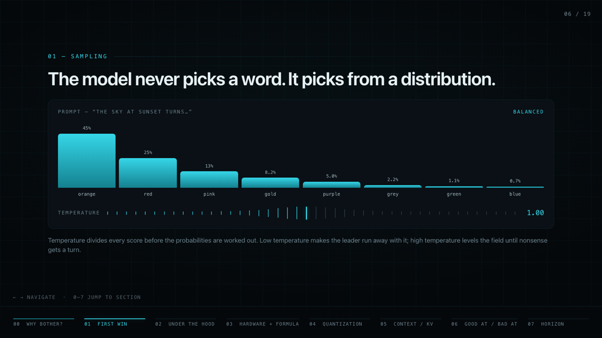
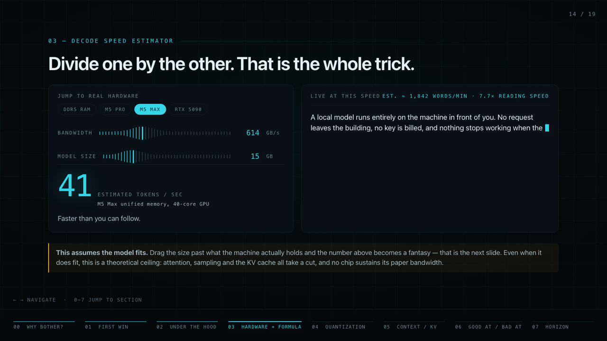
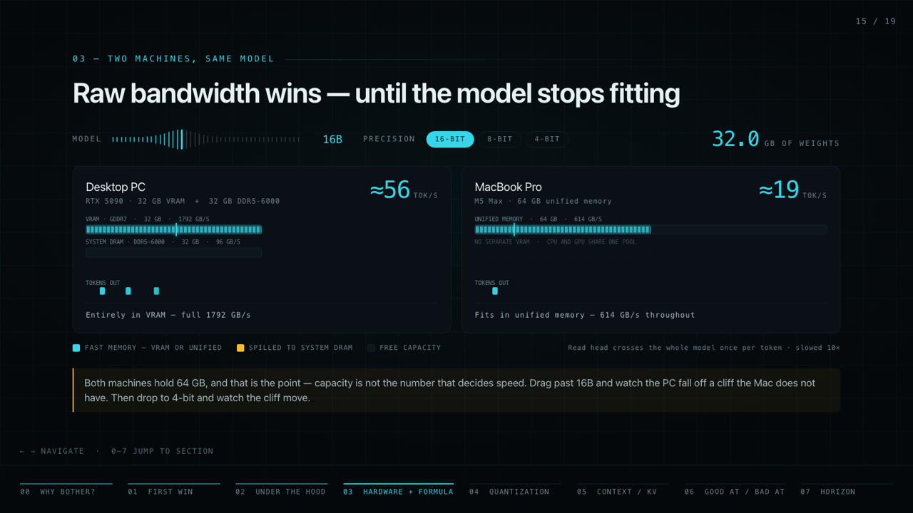
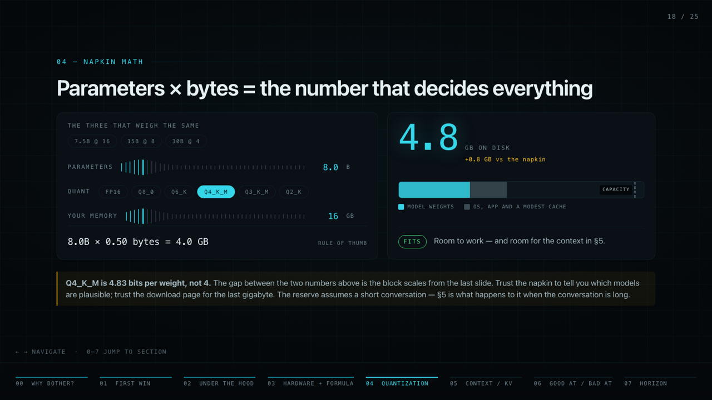
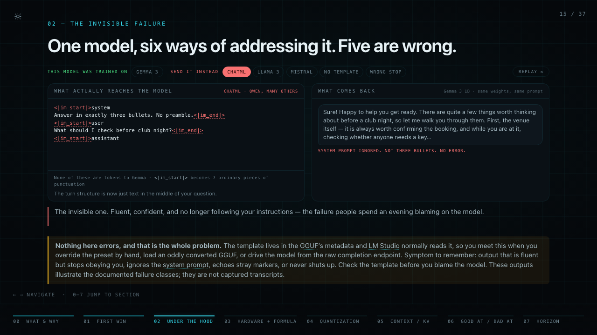

# AI, Unplugged

**Real language models, running on the hardware you already own.**

An interactive, single-file HTML deck for a 2-hour beginners' workshop on running
large language models locally — no cloud, no subscription, no wi-fi.


## What this aims to achieve

Teach a room of beginners to **run a local model on their own laptop**, and leave with a
correct mental model of *why* it performs the way it does.

- **Get it working first.** Everyone installs LM Studio and gets a small model answering
  a question before any theory happens.
- **Explain the technicalities honestly.** Where models come from, what quantization
  actually does to a file, why memory bandwidth — not "GPU power" — decides how fast
  text comes out, and how the context window quietly eats your RAM.
- **Be straight about the trade-offs.** Local models are genuinely good at summarizing,
  transforming text, RAG over your own documents, and anything privacy-sensitive or
  offline. They are genuinely bad at deep reasoning, long agentic tasks and obscure
  facts. Nobody should leave disappointed that their 7B isn't a frontier model.

The whole deck hangs off one formula: `tok/s ≈ memory bandwidth ÷ model size`.

## Why HTML and not slides

Because the concepts are *quantitative*, and a static bullet can't show a number moving.
The deck is built around live interactives — drag a slider, watch the consequence.

**Sampling — temperature reshapes the distribution in real time**



**Decode speed estimator — bandwidth ÷ model size, with real hardware presets**



**Two machines, same model — equal capacity, so bandwidth is the only variable**



**Memory calculator — napkin math against reality, with a fit indicator**



**The chat-template gotcha — the literal string sent, and what comes back**



Each interactive is a teaching device, not decoration: the animations encode a quantity
changing. Drag the model past what a machine holds and you watch it spill from VRAM into
system DRAM, and the token output rate collapse.

## What the workshop covers

| # | Section | Time |
|---|---------|------|
| 0 | What a local LLM is, and why bother — a file, a runner, your memory | 10m |
| 1 | First win — install, download a model, send a message (hands-on) | 20m |
| 2 | What just happened + where models come from (Hugging Face, GGUF, llama.cpp) | 15m |
| 3 | Hardware + the one formula — DRAM vs VRAM, decode vs prefill | 20m |
| 4 | Quantization + napkin math — the ~15 GB trio, the 4-bit floor | 20m |
| 5 | Context window & KV cache — fixed weights + linear cache | 15m |
| 6 | What small models are actually good and bad at | 10m |
| 7 | The horizon — natively low-bit models, diffusion text models | 10m |

All eight sections are built, plus a three-slide close: a five-point recap whose tiles
jump back to the section each point came from, a "where to go next" board to leave up
during questions, and an end frame. One stub remains — the pre-workshop install checklist in §1,
marked `TO BUILD` in the slide source.

**Navigation:** `←` / `→` to move, `0`–`7` to jump to a section, `f` for fullscreen.
The URL hash deep-links to a slide (`index.html#18`).

**Two things to click.** Any word with a faint dotted underline defines itself in
place — 50-odd terms, from *weights* to *GQA*, each with a jump to the section that
covers it properly and, where the term has a famous twin, a *not the same as* note
(fine-tuning vs RAG, the context window vs memory, llama.cpp vs Llama). And the corner
toggle switches the deck between the projector's dark theme and a daylight one for
reading on a laptop; the choice is remembered.

## Build

The deliverable is **one file you can email, put on a USB stick, or double-click** —
`index.html`, with every style, script and logo inlined. It works from `file://` and
needs no network, which is both a practical requirement (club wifi) and on-brand.

Editing 2,000 lines of one file is miserable, so the source is split under `src/` and
assembled by a build script:

```bash
python3 build.py
```

That writes `index.html` at the repo root (readable, committed — **never edit it by
hand**). For a smaller release copy in `dist/` (gitignored):

```bash
python3 build.py --release
```

### What `build.py` does

Python stdlib only, on purpose — it has to build on a laptop with nothing installed.
It's a tiny text splicer with two directives, usable in any source file:

- `<!--#include css/*.css -->` — splice in files; globs allowed, sorted by name
- `<!--#base64 assets/mlx.png -->` — splice in a `data:` URI for a binary asset

Paths resolve relative to `src/`, never to the including file. An include matching zero
files is a hard error — a silent no-op would mean a slide quietly vanishing from the deck.

`--release` does only provably-safe things: strip comments, collapse CSS whitespace. It
deliberately leaves JavaScript untouched — hand-rolling a minifier without a parser is
how you get a bug that appears only in the build you present from.

### Source layout

```text
src/index.html            shell; everything else is spliced into it
src/css/NN-name.css       one file per component
src/js/NN-name.js         one file per feature
src/slides/NN-name.html   one file per slide
src/assets/               logos/*.svg (one <symbol> each), mlx.png
build.py                  stdlib only
tools/glossary-audit.py   glossary coverage check, stdlib only
index.html                BUILT, committed
dist/index.html           BUILT release, gitignored
```

The `NN-` prefixes are load-bearing. Includes glob and sort by filename, so the prefix
*is* the cascade order for CSS, the execution order for JS, and the slide order for the
deck. Renaming without renumbering silently reorders the presentation.

The JS files are concatenated inside one shared IIFE, so they behave as a single script —
helpers defined in one file are used by another. No per-file IIFEs, and no file is
independently loadable.

### Checking the glossary

Terms in the slides are underlined and defined by a DOM pass at load, not by hand — so
nothing guarantees the glossary and the slides still describe the same deck. This does:

```bash
python3 tools/glossary-audit.py --strict
```

It opens the built deck at `?audit` in headless Chrome and prints what the page found:
entries no slide uses, jargon no entry defines, terms that lost a slide's marking budget,
and what each slide actually marked. The first two fail the check. You can also open
`index.html?audit` in a browser and read the same report as an overlay.

## Conventions

Design decisions, palette rules and content guidance live in [CLAUDE.md](CLAUDE.md).
The short version: cyan owns all structure, warm colors are reserved for meaning
(fit / warning / failure), numbers are always monospace, and an animation must encode a
variable rather than decorate one.

## License

Two halves, because this repo holds two kinds of work:

- **Code** — MIT. `build.py`, `tools/`, `src/js/`, `src/css/`, `src/index.html`. See
  [LICENSE](LICENSE).
- **Deck content** — CC BY 4.0. The slides, posters, speaker notes and docs. See
  [LICENSE-CONTENT](LICENSE-CONTENT). Run it at your own club, adapt it, translate it,
  correct the figures — just credit it and link back.

**Third-party logos and screenshots are excluded from both.** They belong to their
owners, several are trademarks, and they are inlined into the built `index.html` and
posters as well as living in `src/assets/` — so the carve-out follows them there. One,
the llama.cpp mark, is NonCommercial. [ATTRIBUTIONS.md](ATTRIBUTIONS.md) lists every
asset, where it came from, and what that means if you reuse this.
